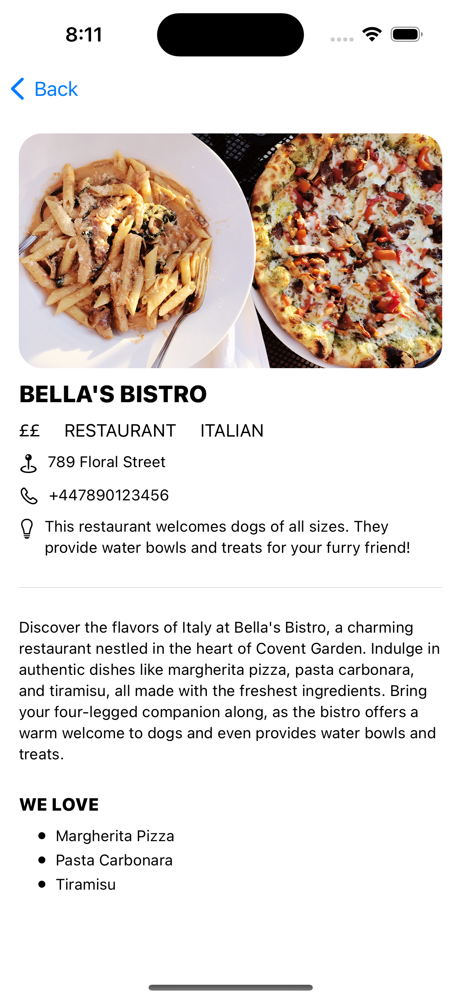

# SPOT - dog friendly restaurant app

 
&nbsp; &nbsp; &nbsp; &nbsp;
  

 

 
&nbsp; &nbsp; &nbsp; &nbsp;
  

Icon attribution

- <a href="https://www.flaticon.com/free-icons/fish-and-chips" title="fish-and-chips icons">Fish-and-chips icons created by juicy_fish - Flaticon</a>
- <a href="https://www.flaticon.com/free-icons/pasta" title="pasta icons">Pasta icons created by Flat-icons-com - Flaticon</a>
- <a href="https://www.flaticon.com/free-icons/burger" title="burger icons">Burger icons created by Freepik - Flaticon</a>
- <a href="https://www.flaticon.com/free-icons/naan" title="naan icons">Naan icons created by Icongeek26 - Flaticon</a>
- <a href="https://www.flaticon.com/free-icons/cake" title="cake icons">Cake icons created by monkik - Flaticon</a>
- <a href="https://www.flaticon.com/free-icons/salad" title="salad icons">Salad icons created by Freepik - Flaticon</a>
- <a href="https://www.flaticon.com/free-icons/curry" title="curry icons">Curry icons created by amonrat rungreangfangsai - Flaticon</a>
- <a href="https://www.flaticon.com/free-icons/seafood" title="seafood icons">Seafood icons created by surang - Flaticon</a>
- <a href="https://www.flaticon.com/free-icons/sea-food" title="sea food icons">Sea food icons created by Icongeek26 - Flaticon</a>
- <a href="https://www.flaticon.com/free-icons/sushi" title="sushi icons">Sushi icons created by justicon - Flaticon</a>
- <a href="https://www.flaticon.com/free-icons/food" title="food icons">Food icons created by amonrat rungreangfangsai - Flaticon</a>
- <a href="https://www.flaticon.com/free-icons/ramen" title="ramen icons">Ramen icons created by Flat Icons - Flaticon</a>
